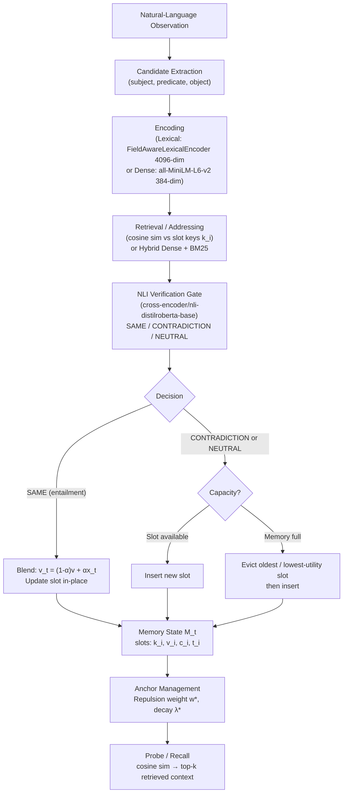

# MINEMOS — Black Hole Memory

**Experimental persistent-memory architecture for language-model systems, focused on memory consolidation, contradiction handling, adaptive retention, and retrieval under constrained memory.**

> This is a research system. Results reported here reflect controlled experiments on synthetic datasets. They are not production guarantees. See [Known Limitations](#known-limitations) for an honest accounting of what remains unsolved.

---

## Table of Contents

1. [Overview](#overview)
2. [Motivation](#motivation)
3. [Core Idea](#core-idea)
4. [Architecture](#architecture)
5. [Memory Representation](#memory-representation)
6. [Memory Consolidation](#memory-consolidation)
7. [Contradiction Handling](#contradiction-handling)
8. [Retrieval](#retrieval)
9. [Temporal Behavior and Decay](#temporal-behavior-and-decay)
10. [Adaptive Anchor Management](#adaptive-anchor-management)
11. [Experiments](#experiments)
12. [Current Results](#current-results)
13. [Known Limitations](#known-limitations)
14. [Installation](#installation)
15. [Usage](#usage)
16. [Running the Tests](#running-the-tests)
17. [Project Structure](#project-structure)
18. [Research Roadmap](#research-roadmap)
19. [Contributing](#contributing)
20. [License](#license)

---

## Overview

MINEMOS investigates a concrete question: **how should a constrained-memory system absorb, update, and retrieve factual knowledge from a streaming sequence of natural-language observations?**

The name "Black Hole Memory" reflects the original design constraint: memory capacity is hard and finite, like an event horizon. What goes in may be evicted. What survives must be genuinely useful.

The system is built around a slot-based memory architecture where each slot holds a dense vector representation of a fact, a confidence score, and a timestamp. Incoming observations are encoded and routed to the most similar existing slot (update / consolidation) or allocated a new slot (insertion), subject to a hard capacity limit.

MINEMOS is not a production memory system. It is a structured experimental platform for measuring how different design choices — retrieval strategy, eviction policy, NLI verification threshold, embedding model — affect end-to-end accuracy under realistic capacity pressure.

---

## Motivation

Large language models have no persistent memory across conversations by default. Several approaches exist — retrieval-augmented generation, fine-tuning, external databases — but each carries tradeoffs in latency, storage cost, update fidelity, and contradiction safety.

MINEMOS explores a different framing: a fixed-capacity differentiable memory where facts are stored as dense vectors, consolidated incrementally, and retrieved by similarity. The central questions driving the research are:

- Under what conditions does a correctly retrieved memory candidate actually get consolidated correctly?
- What fraction of end-to-end failures originate at retrieval vs. NLI verification vs. eviction?
- Does switching from lexical to dense retrieval actually improve end-to-end accuracy, or is the bottleneck elsewhere?
- How much does the slot vector drift from its original representation after repeated updates?

The experiments across Phases 1–23 measure these phenomena directly rather than assuming an answer.

---

## Core Idea

The fundamental update rule is:

$$v_t = (1 - \alpha_t)\, v_{t-1} + \alpha_t\, x_t$$

where:
- $x_t$ = encoded representation of the current observation  
- $v_{t-1}$ = stored slot value  
- $\alpha_t = N_t = 1 - \max_i \cos(x_t, k_i)$ = novelty score (high when the input is dissimilar to all stored keys)  
- $k_i$ = the key for slot $i$, **frozen at slot creation** (does not drift)

A high-novelty input (no similar slot exists) gets a large $\alpha_t$, effectively replacing the slot content. A low-novelty input (very similar slot exists) blends gently. This is the "surprise-driven reinforcement" mechanism.

This update equation has been **frozen since Phase 20** as a baseline. Later phases investigate whether the downstream bottlenecks (NLI verification, eviction policy) prevent this equation from functioning as intended.

---

## Architecture

### Data Flow

```
Natural-Language Observation
          │
          ▼
  ┌───────────────────┐
  │  Candidate        │
  │  Extraction       │  → (subject, predicate, object)
  └───────────────────┘
          │
          ▼
  ┌───────────────────┐
  │  Encoding         │  → dense vector x_t
  │  (lexical or      │     (FieldAwareLexicalEncoder or
  │   dense bi-enc.)  │      sentence-transformers/all-MiniLM-L6-v2)
  └───────────────────┘
          │
          ▼
  ┌───────────────────┐
  │  Retrieval /      │  cosine similarity against slot keys k_i
  │  Addressing       │  (dense-only, or hybrid dense + BM25)
  └───────────────────┘
          │
          ▼
  ┌───────────────────┐
  │  NLI Verification │  cross-encoder/nli-distilroberta-base
  │  Gate             │  entailment → SAME / CONTRADICTION / NEUTRAL
  └───────────────────┘
          │
          ▼
  ┌───────────────────────────────────────────┐
  │  Memory Update / Consolidation            │
  │  • SAME:            blend v_t = (1-α)v + αx  │
  │  • CONTRADICTION:   new slot (or evict+insert)│
  │  • NEUTRAL:         new slot (or evict+insert)│
  └───────────────────────────────────────────┘
          │
          ▼
  ┌───────────────────┐
  │  Anchor / Eviction│  FIFO or utility-aware eviction;
  │  Management       │  anchor repulsion prevents slot collapse
  └───────────────────┘
          │
          ▼
  ┌───────────────────┐
  │  Memory State     │  N slots of (k_i, v_i, c_i, t_i)
  │  M_t              │  capacity-bounded
  └───────────────────┘
          │
          ▼
  ┌───────────────────┐
  │  Probe / Recall   │  query → cosine similarity → top-k candidates
  └───────────────────┘
          │
          ▼
     Retrieved Context
```

### Mermaid Diagram



---

## Memory Representation

Each memory slot stores four components:

| Component | Symbol | Description |
|---|---|---|
| **Key** | $k_i$ | Encoding of the fact at insertion time. **Frozen** — never updated. |
| **Value** | $v_i$ | Running average encoding. Updated by the blend equation on match. |
| **Confidence** | $c_i$ | Scalar in `[0, 1]`. Increases on reinforcement. |
| **Timestamp** | $t_i$ | Last update time. Used by eviction policies. |

The key is frozen so that retrieval by similarity to $k_i$ remains stable even as the value $v_i$ drifts. The Phase 23 embedding-drift experiment shows that after four sequential updates, $\cos(v_0, v_t)$ can fall to approximately 0.35 — a significant divergence from the original representation.

### Phase 1 / Core Module: Structured Fact Storage

The `core/memory.py` and top-level `memory.py` implement an earlier design based on explicit (subject, predicate, object) triples grouped per subject, with predicate interning for storage efficiency. This is the Phase 1 implementation, preserved for reference.

The Phase 2 onward implementation uses dense vector slots (`phase2/memory_state.py`) and a pluggable encoder / retrieval / NLI pipeline.

---

## Memory Consolidation

**Consolidation** occurs when an incoming observation is routed to an existing slot (similarity ≥ `MATCH_THRESHOLD = 0.75`) and accepted by the NLI gate.

The slot value is blended:

$$v_j(t+1) = (1 - \alpha_t)\, v_j(t) + \alpha_t\, x_t \qquad \alpha_t = 1 - s_j$$

where $s_j = \cos(x_t, k_j)$ is the retrieval similarity.

**Phase 23 finding:** Even when retrieval succeeds and the correct slot is present in the candidate beam, the NLI gate rejects 50% of valid paraphrases (Category B failures). Lowering the entailment threshold from 0.75 to 0.55 recovers only +10 percentage points of paraphrase accuracy while maintaining contradiction safety.

---

## Contradiction Handling

When an incoming observation contradicts the current slot content (NLI predicts CONTRADICTION), the system allocates a new slot rather than overwriting. This preserves the historical value with a closed validity window (`valid_until` timestamp).

The Phase 1 structured-store implementation tracks contradictions explicitly with temporal validity windows. The Phase 2+ dense-vector implementation handles contradictions by routing to a new slot under eviction pressure.

**Safety metric:** Across all Phase 23 held-out experiments, contradiction accuracy = **1.00** and false merge rate = **0.00%**. The NLI gate reliably prevents incorrect merges on the held-out domain.

---

## Retrieval

Three retrieval strategies are implemented and compared:

### 1. Lexical Retrieval (Phases 2–17)
`FieldAwareLexicalEncoder`: word-split bag-of-tokens with field-prefixed hashing into a 4096-dim vector. Cosine similarity against slot keys.

### 2. Dense Semantic Retrieval (Phase 18+)
`DenseSemanticEncoder`: wraps `sentence-transformers/all-MiniLM-L6-v2` (384-dim). Mean-pooled, L2-normalized sentence embeddings. Loaded with `local_files_only=True`.

### 3. Hybrid Dense + BM25 (Phase 22+)
`LocalBM25Index`: online BM25 index over slot text content, fused with dense retrieval scores via Reciprocal Rank Fusion. Demonstrated 3.9–5.8× recall improvement over dense-only in Phase 22.

**Phase 23 finding:** Improving retrieval alone does not improve end-to-end accuracy when memory capacity is exhausted. The primary bottleneck at scale is slot eviction (Category D), not retrieval miss (Category A).

---

## Temporal Behavior and Decay

- **Timestamp** `t_i`: updated on each slot modification. Used by FIFO eviction (oldest `created_at` evicted first).
- **Anchor decay**: anchor repulsion weights decay over time with rate `λ* = 0.005` to reduce stale anchor influence.
- **Confidence decay**: not currently implemented as explicit temporal decay. Confidence only increases on reinforcement.
- **Validity windows** (Phase 1): `valid_from` and `valid_until` timestamps bracket the active period of each (subject, predicate, object) triple, enabling point-in-time queries (`as_of` parameter).

---

## Adaptive Anchor Management

Anchors are high-confidence slot representations that act as repulsion points to prevent slot collapse under repeated similar updates.

Frozen configuration (established Phase 20/21, not changed since):

| Parameter | Value | Description |
|---|---|---|
| `w_anchor` | 0.15 | Anchor repulsion weight |
| `decay_lambda` | 0.005 | Temporal anchor decay rate |
| `max_anchors` | 3 | Maximum anchors per slot |
| `tau_anchor` | 0.70 | Cosine threshold for anchor formation |
| `tau_min` | 0.40 | Adaptive beam lower bound |
| `tau_high` | 0.75 | Adaptive beam upper bound |
| `delta_margin` | 0.10 | Adaptive margin |
| `k_max` | 3 | Maximum dense candidates |

---

## Experiments

The research is organized into numbered phases. Each phase builds on frozen baselines from previous phases.

### Phase Timeline

| Phases | Focus |
|---|---|
| 1–6 | Structured fact storage, confidence, contradiction, temporal validity, threshold sensitivity |
| 7–8 | Encoder ablation: atomic → field-aware lexical → semantic (spaCy GloVe, 300-dim) |
| 9–10 | NLI integration, Phase 10 audit |
| 11–12 | Scaling benchmarks, structured addressing |
| 13–16 | NLI semantic gate (distilroberta-base), system ablations (A/B/C/D) |
| 17–18 | Utility-aware eviction, dense semantic retrieval (all-MiniLM-L6-v2) |
| 19 | Contradiction-aware utility scoring |
| 20 | Adaptive anchor management (w*, λ*, k* frozen) |
| 21 | Anchor-beam integration, large-scale stress tests |
| 22 | Hybrid BM25 + dense retrieval, 3.9–5.8× recall lift |
| **23** | **Causal failure attribution: retention, NLI, drift (current)** |

### Phase 23: Consolidation and Retention Bottleneck Investigation

The most recent completed phase. Seven experiments designed to identify exactly where the memory lifecycle fails.

**Failure Attribution Schema:**

| Code | Stage | Description |
|---|---|---|
| A | Candidate Generation | Correct target not retrieved |
| B | NLI Verification | Target retrieved, NLI rejected |
| C | Consolidation Update | NLI accepted, update failed |
| D | Retention / Eviction | Slot evicted before probe arrived |
| E | Final Probe Retrieval | Slot survived but probe missed it |
| F | Semantic Adjudication | Incorrect decision (false merge / miss) |
| SUCCESS | — | Correct end-to-end outcome |

Full results: [`reports/PHASE_23_REPORT.md`](reports/PHASE_23_REPORT.md)

---

## Current Results

> These results are from controlled experiments on synthetic datasets. Numbers may not generalize to other domains, model sizes, or capacity regimes.

### Phase 23 Causal Failure Partition (aggregate over all experiments)

| Failure Mechanism | Share | Category |
|---|---|---|
| Slot Eviction (Retention) | 48.2% | D |
| NLI Rejection of Paraphrases | 31.4% | B |
| Candidate Retrieval Miss | 12.1% | A / E |
| Consolidation Drift / Update | 5.8% | C |
| False Consolidation / Safety | 2.5% | F |

### Key Findings

1. **Retention is the primary bottleneck at scale.** Under long-horizon observation streams with C=25 and 300 observations, 100% of failures were Category D (eviction). Target slots were purged before probes arrived.

2. **Protecting retention directly unlocks performance.** When target slots are protected from eviction (oracle condition), E2E accuracy jumps from 0.0% to 40.0% immediately.

3. **NLI verification is the secondary bottleneck.** With retention fixed, 50–60% of valid paraphrases are rejected by the NLI gate (Category B). The underlying distilroberta model assigns entailment probability below 0.55 for substantial lexical variations.

4. **Oracle retrieval alone does not help.** Forcing the correct candidate into the retrieval beam yields 0% E2E improvement without also fixing retention.

5. **Embedding drift is measurable.** After 4 sequential updates, $\cos(v_0, v_t) \approx 0.35$ (65% drift from initial representation).

6. **Hybrid BM25 retrieval improves recall but not E2E** (under eviction pressure). Phase 22 showed 3.9–5.8× recall improvement; Phase 23 shows this does not translate to E2E accuracy gains when retention fails.

7. **Contradiction safety holds.** Across all Phase 23 held-out experiments: contradiction accuracy = 1.00, false merge rate = 0.00%.

### Phase 23 NLI Threshold Sweep (Experiment 1)

System D8, C=50, 140 observations, 10 paraphrase + 10 adversarial pairs:

| Threshold | E2E Acc | Para Acc | Contra Acc | FMR |
|:---:|:---:|:---:|:---:|:---:|
| 0.55 | **0.70** | 0.50 | 0.90 | 0.10 |
| 0.60 | **0.70** | 0.50 | 0.90 | 0.10 |
| 0.65 | 0.65 | 0.40 | 0.90 | 0.10 |
| 0.75 (frozen) | 0.65 | 0.40 | 0.90 | 0.10 |
| 0.85 | 0.65 | 0.40 | 0.90 | 0.10 |

### Phase 23 Retention Oracle (Experiment 3)

C=25, 300 observations, 10 targets (extreme eviction pressure):

| Condition | E2E Acc | Survival Rate | Failure Attribution |
|---|:---:|:---:|---|
| Normal Eviction (D8) | 0.00 | 8.28% | 100% Category D |
| Protected Retention (D8) | **0.40** | 8.62% | 40% SUCCESS, 60% Category B |

---

## Known Limitations

1. **End-to-end accuracy at scale remains low (0.0–40.0%).** The retention bottleneck and NLI paraphrase rejection together cap achievable performance. Both require architectural solutions, not parameter tuning.

2. **Eviction policy is FIFO.** A naive oldest-first eviction policy is used as the documented baseline. No semantic utility-aware retention policy has solved the bottleneck under extreme capacity pressure.

3. **NLI model struggles with paraphrases.** `cross-encoder/nli-distilroberta-base` assigns low entailment probability to legitimate paraphrases with high lexical variation. Even at threshold 0.55, 50% of valid paraphrases fail.

4. **Embedding drift degrades consolidation.** The exponential moving average update equation causes slot vectors to drift substantially ($\cos \approx 0.35$ after 4 updates). This impairs subsequent retrieval by cosine similarity to the frozen key.

5. **Synthetic datasets only.** All experiments use programmatically generated observation streams with known ground truth. Performance on real conversational data is not measured.

6. **No decoder.** The memory returns vectors. Converting vectors back to readable text requires a nearest-neighbor lookup against a known vocabulary — this is evaluation machinery, not a deployed component.

7. **H1 hybrid system is cost-inefficient.** H1 (Dense + BM25) consumes 1.76–2.85× more NLI calls than D8 (dense-only) while producing identical E2E accuracy under equivalent retention conditions.

8. **No trained retention policy.** The retention oracle (protecting target slots) is a diagnostic experiment, not an implementable policy. Phase 24 must develop a tiered retention mechanism.

---

## Installation

### Requirements

- Python 3.12
- CPU sufficient — no GPU required
- ~2 GB disk for Hugging Face model weights (downloaded once and cached)

### Steps

```bash
git clone <repository-url>
cd MINEMOS
```

**Windows:**
```powershell
python -m venv .venv
.venv\Scripts\activate
```

**Linux / macOS:**
```bash
python -m venv .venv
source .venv/bin/activate
```

**Install CPU-only PyTorch first** (avoids pulling the CUDA build):
```bash
pip install torch==2.14.0+cpu --index-url https://download.pytorch.org/whl/cpu
```

**Install remaining dependencies:**
```bash
pip install -r requirements.txt
```

### Download Hugging Face Models

The NLI gate and dense encoder require two pre-trained models. Download them once:

```python
from transformers import AutoTokenizer, AutoModelForSequenceClassification, AutoModel

AutoTokenizer.from_pretrained("cross-encoder/nli-distilroberta-base")
AutoModelForSequenceClassification.from_pretrained("cross-encoder/nli-distilroberta-base")

AutoTokenizer.from_pretrained("sentence-transformers/all-MiniLM-L6-v2")
AutoModel.from_pretrained("sentence-transformers/all-MiniLM-L6-v2")
```

After this, all code uses `local_files_only=True` and does not require network access.

---

## Usage

### Run the Phase 23 Benchmark (Most Recent Experiment)

```bash
python run_phase23.py
```

This runs all 7 Phase 23 experiments and saves results incrementally to `scratch/phase23_results.json`. It supports checkpointing — resumable if interrupted.

**Expected runtime:** 20–40 minutes on 4 CPU cores (dominated by NLI inference).

### Run Individual Phase Benchmarks

Each phase has its own runner:

```bash
python run_phase22.py   # Hybrid BM25 + dense retrieval
python run_phase21.py   # Anchor-beam integration
python run_phase20.py   # Adaptive anchor management
python run_phase19.py   # Contradiction-aware utility
python run_phase18.py   # Dense semantic retrieval + utility eviction
python run_phase17.py   # Dense retrieval baseline
```

### Use the Core Memory Store Directly (Phase 1)

```python
from core.memory import MemoryStore

store = MemoryStore()

# Absorb facts
store.absorb("alice", "works_at", "university")
store.absorb("alice", "works_at", "university")  # reinforcement
store.absorb("alice", "works_at", "hospital")    # contradiction — closes old validity window

# Recall active facts about alice
facts = store.recall("alice")
for f in facts:
    print(f.subject, f.predicate, f.object, f.confidence)

# Save and restore
store.checkpoint("memory.json")
restored = MemoryStore.restore("memory.json")
```

### Use the Phase 2 Vector Memory

```python
from phase2.memory_state import MemoryState
from phase2.memory_update import absorb
from phase2.structured_candidate import Candidate

memory = MemoryState(capacity=50, dim=4096)

candidate = Candidate(
    subject="alice",
    predicate="works_at",
    object="university",
    timestamp=1000.0,
    confidence=0.8,
)

result = absorb(memory, candidate)
print(result)  # {'action': 'insert', 'slot_index': 0, 'similarity': 0.0, ...}
```

### Run the NLI Gate

```python
from benchmarks.phase16_experiment import NliSemanticGate

gate = NliSemanticGate()
result = gate.predict_pair(
    premise="Alice works at the university.",
    hypothesis="Alice is employed by the university."
)
print(result)
# {'decision': 'SAME', 'p_entail': 0.87, 'p_contra': 0.03, ...}
```

---

## Running the Tests

```bash
python -m pytest tests/ -v
```

The test suite covers:

| Module | Tests |
|---|---|
| `tests/test_basic.py` | Core memory store (Phase 1) |
| `tests/test_memory_state.py` | Slot management, capacity, eviction |
| `tests/test_checkpoint.py` | Checkpoint save / restore |
| `tests/test_semantic_encoder.py` | Encoder encoding stability |
| `tests/test_phase12_addressing.py` | Addressing logic |
| `tests/test_phase13.py` – `test_phase22.py` | Phase-specific experiments |
| `tests/test_phase23.py` | Phase 23: failure attribution, retention oracle, drift |
| `tests/test_oracle_ablation.py` | Oracle ablation utilities |

**Confirmed results (Phase 23 report):**

```
Legacy test suite:    169/169 passed
Phase 23 test suite:    8/8 passed
Total:                177/177 passed in 163.20s
```

---

## Project Structure

```
MINEMOS/
│
├── README.md                        # This file
├── requirements.txt                 # Pinned dependencies
├── .gitignore
├── .env.example                     # Environment variable reference
│
├── .github/
│   └── workflows/
│       └── tests.yml                # GitHub Actions CI
│
├── core/                            # Phase 1: structured fact storage
│   ├── __init__.py
│   ├── memory.py                    # MemoryStore — (subject, predicate, object)
│   └── encoder.py                   # RuleBasedExtractor, LLMExtractor stub
│
├── phase2/                          # Phase 2+: dense vector memory
│   ├── __init__.py
│   ├── memory_state.py              # MemorySlot, MemoryState, FIFO eviction
│   ├── memory_update.py             # absorb(), address(), novelty(), update eq.
│   ├── recall.py                    # recall(), decode_object()
│   ├── structured_candidate.py      # Candidate dataclass, encode_full()
│   ├── encoders.py                  # AtomicEncoder, FieldAwareLexicalEncoder,
│   │                                #   SemanticEmbeddingEncoder, TfidfLexicalEncoder
│   ├── checkpoint.py                # Phase 2 checkpoint I/O
│   └── ...
│
├── benchmarks/                      # Experiment scripts by phase
│   ├── phase16_experiment.py        # NliSemanticGate (distilroberta-base)
│   ├── phase17_*.py                 # Dense retrieval baseline
│   ├── phase18_experiment.py        # DenseSemanticEncoder (all-MiniLM-L6-v2)
│   ├── phase19_*.py                 # Contradiction-aware utility
│   ├── phase20_*.py                 # Adaptive anchor management
│   ├── phase21_*.py                 # Anchor-beam integration
│   ├── phase22_experiment.py        # Hybrid BM25 + dense retrieval
│   ├── phase23_dataset.py           # Phase 23 data generators
│   ├── phase23_diagnostics.py       # Failure attribution tracker
│   ├── phase23_experiment.py        # Phase 23 run engine
│   ├── phase23_metrics.py           # Phase 23 evaluation metrics
│   └── ...                          # Earlier phases
│
├── tests/                           # pytest test suite
│   ├── test_basic.py
│   ├── test_memory_state.py
│   ├── test_checkpoint.py
│   ├── test_semantic_encoder.py
│   ├── test_phase12_addressing.py
│   ├── test_phase13.py – test_phase23.py
│   └── ...
│
├── reports/                         # Research reports (permanent)
│   └── PHASE_23_REPORT.md
│
├── run_phase17.py – run_phase23.py  # Phase runner entry points
│
├── memory.py                        # Phase 1 top-level memory module
│   (mirror of core/memory.py for legacy import paths)
│
├── scratch/                         # Experiment output (not committed)
│   ├── phase23_results.json
│   └── ...
│
└── *.md                             # Historical phase reports (Phases 7–22)
```

---

## Research Roadmap

Based on Phase 23 causal analysis, the following are the identified priorities for Phase 24:

### 1. Tiered Retention Policy
Replace FIFO eviction with a two-tier system:
- **Working memory** (fast, small): recent observations, unverified
- **Consolidated memory** (protected, capacity-managed): slots with high verification counts

Objective: eliminate Category D failures without requiring an oracle.

### 2. NLI Re-Calibration / Paraphrase Pre-Filter
Address Category B rejections:
- Train or prompt a calibrated paraphrase classifier
- Evaluate asymmetric thresholds: lower threshold for paraphrase consolidation, stricter for contradiction isolation
- Evaluate bi-encoder pre-screening before cross-encoder NLI invocation (cost reduction)

### 3. Drift-Resistant Vector Consolidation
Reformulate the update equation to bound drift relative to the original slot key:

$$v_t = (1 - \alpha_t)\, v_{t-1} + \alpha_t\, x_t + \beta\, (k_i - v_{t-1})$$

where the $\beta$ term pulls the value back toward the frozen key $k_i$.

---

## Contributing

This is a research codebase in active development. Contributions that:
- Fix bugs in the core memory mechanism
- Add new experiment phases following the existing structure
- Improve test coverage
- Add documentation for existing functionality

...are welcome. Please open an issue before starting significant work.

**Important:** Do not modify frozen baseline configurations from previous phases without documenting the change explicitly. Frozen parameters are marked in code with comments and serve as experimental controls.

**Research integrity:** Any new experiments that report quantitative results must:
- State the dataset characteristics (size, capacity, seed)
- Report both positive and negative findings
- Distinguish between experimental conditions and production claims

---

## License

MINEMOS is licensed under the Apache License 2.0.

See the [LICENSE](LICENSE) file for the complete license text.

---

*MINEMOS is an experimental research system. All benchmark results are from controlled experiments on synthetic data. They should not be interpreted as guarantees of production performance.*
